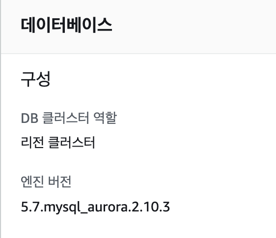

## 작업 배경

- AWS RDS 엔진버전이 2.10.3 지원 중단
- 2.11 버전으로 자동 업그레이드 가능하나, 운영 서버의 다운타임 우려
- 다운타임은 불가피 하므로, 이 기회에 <b>MySQL 8.x 버전으로 업그레이드 진행 결정</b>


## 작업대상

: 클라우드게이트 RDS, 셀러게이트 RDS 전체



-> 지원중단 관련 [공고](https://docs.aws.amazon.com/AmazonRDS/latest/AuroraMySQLReleaseNotes/AuroraMySQL.Updates.2103.html)

  

## 사전 준비

### 1) 업그레이드 테스트
- 테스트를 위한 DB 세팅
	1. 기존 DB 스냅샷을 뜬다
	2. 그 스냅샷으로 test용 DB를 띄운다
	3. test용 DB를 버전 업그레이드 해본다
	4. 이슈가 있다면 모두 수정 및 이슈 해결 한다
	5. 모든 이슈가 해결되면 본 DB를 업그레이드 진행한다
-  환경별 테스트스 순서
	- develop DB에서 1차 테스트
	- 실 운영 DB의 스탭샷으로 2차 테스트 진행

#### 실서버 DB 스냅샷 테스트
* 작업 방식은 크게 두 가지
* 블루/그린 배포 방식 : down time을 최소화 하면서 RDS를 교체하는 방식
* 인플레이스 방식 : 기존 RDS를 바로 버전 업 하는 방식. 작업하는 동안 서비스 운영 불가
- AWS 에서는 블루그린 배포 방식을 권장하기에 두 방식 모두 테스트 해보기로 함

<br>
##### 실서버 DB 테스트 작업 계획
- 운영 DB 스냅샷을 두 개 복원한 뒤, 하나는 블루그린 테스트용 다른 하나는 인플레이스용으로 세팅<br>


- 각 버전의 공통 체크 리스트<br>
	1. 파라미터 그룹 값들 확인하기
	2. api 연결 체크
	3. 버전 업 총 소요 시간 체크

- 블루/그린 버전일 때 추가 체크
	- 블루 -> 그린으로 전환될 때 엔드포인트도 변경되는지 확인

  

##### 테스트 결과

- 블루그린 배포 방식
	- 총 6시간 소요
	- 기존 SQL mode 설정값 때문에 버전업이 원활하지 않은 이슈가 있었으나 해결
	- 엔드포인트 변함 없음
- 인플레이스 배포 방식
	- 파라미터 그룹 값 : 기존과 동일하게 세팅 및 확인 완료
	- api 연결 체크 : 로컬에서 직접 접근으로 확인 완료
	- 버전 업 총 소요 시간 : 21분 소요 (16:57 ~ 17:18)

  
##### 테스트 중 만난 이슈
**1. 파라미터 그룹에서 charset 설정을 안 해준 때에 데이터가 ?로 저장**
	- 파라미터그룹이 default 일 때 저장된 값
	
	-> 파라미터 그룹 내, charset 설정을 모두 진행 후 테스트했더니 정상 노출 돼었다.
 
**2. 셀러게이트 RDS 업그레이드 시, upgrade-precheck 실패로 업그레이드 실패 이슈**
	- 이 역시 파라미터 그룹의 차이 때문에 발생한 이슈
		- pre-check를 통과한 RDS와의 차이는 `sql_mode가 지정 값이 없느냐, TRADITIONAL로 세팅돼 있냐 차이`였음
		- `최종적으로는 sql_mode에 지정값을 없애고 진행`해 정상 작동함
	- AWS에서 메이저 업그레이드할 때 precheck를 해주는데 에러 발생 시, 로그를 확인할 수 있음
		- Warning은 업그레이드 가능하지만, Error가 발생하면 업그레이드가 불가
		- 당시 에러 로그는 아래와 같았음
		```Json
		{
			"id": "auroraUpgradeCheckForSpecialCharactersInProcedures",
			"title": "Check for inconsistency related to special characters in stored procedures.",
			"status": "ERROR",
			"description": "Invalid default value for 'modified'"
		}
		```
	- 해결 방법을 찾기 위한 여정
		1. 첫 번째 검색 키워드 : `procedure`
			- ‘호환되지 않아 사전에 주의해야할 부분’ 중에 프로시저에 대한 설명이 있었음
			- `SHOW PROCEDURE STATUS;` 실행 후 확인해봤으나 직접 설정한 프로시저는 없었음
			- 설정하지도 않은 부분에서 에러가 날 수 없기 때문에 이 부분은 아닐 것이라 생각하고 다음 키워드 진행
		2. 두번째 검색 키워드 : `character, character set`
			- ‘호환되지 않아 사전에 주의해야할 부분’ 중에 character set에 대한 설명 또한 있었음
			- 역시 확인해봤으나 설정에 걸리는 부분이 없음
	- 결론
		1. 함부로 DB 설정을 바꾸면 안되지만 시니어들과 상의 후, sql_mode를 껐음
			- DB 세팅의 base로 삼는 클라우드게이트에는 sql_mode가 설정돼 있지 않다는 점
			- TRADITIONAL로 세팅한 히스토리 및 사유를 아는 사람이 없다는 점
			- 버전 업그레이드 진행이 최우선 과제라는 점
			- 위 세 가지 주된 이유로 설정을 껐음
		2. 다만 현재까지 sql_mode와 로그 상 에러 메시지의 상관 관계를 몰라서 미해결 과제로 남겨두고 있다는 부분이 아쉬움

<br>

## 업그레이드 진행 (3/26(일) 오전 1:00)
### 작업 순서
1. 기존 서버들 binlog_format mixed로 변경, 재부팅
2. 블루그린 생성
3. 그린(버전업)을 prod로 스위칭
4. 기존 버전 삭제
<br>

### 작업 결과
- 현재까지 특별한 이슈 없이, 정상 작동해 프로젝트 종료


---
##### 관련 내용
<!-- - [MySQL 5.7 -> 8.0의 차이점은?](https://velog.io/@dev-hr2/Mysql-5.7%EA%B3%BC-8.0%EC%9D%98-%EC%B0%A8%EC%9D%B4%EC%A0%90%EC%9D%80) -->
- [MySQL 5.7 -> 8.0의 차이점은?](https://harim2da.github.io/blogs/diff-mysql5-8)
- 다중 AZ 구성 : [다중AZ란?](https://docs.aws.amazon.com/ko_kr/AmazonRDS/latest/UserGuide/Concepts.MultiAZ.html)