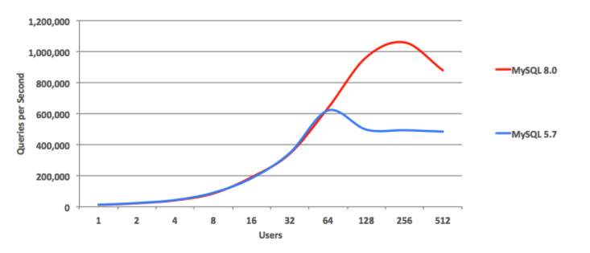
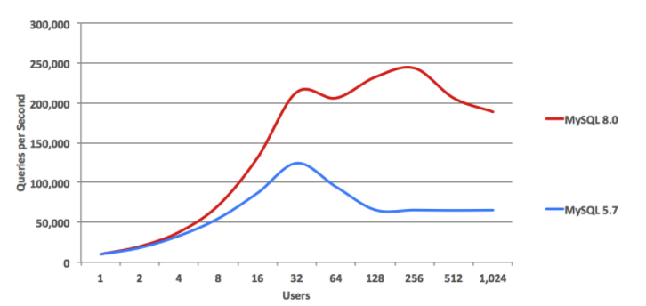
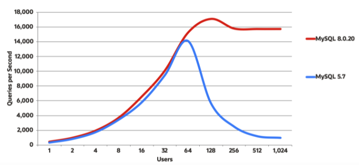

회사에서 쓰던 MySQL 5.7 버전을 8.x 버전으로 업그레이드 할 필요가 생겼다.
그래서 두 버전의 차이점과 업그레이드 작업 시 주의할 점을 간단하게 알아봤다.

### 5.7 버전에 비해 개선된 점
**1. IO 바운드 읽기 전용**

-> 내림차순 인덱스를 지원하면서 읽기 성능에서 크게 개선됨

**2. 읽기, 쓰기의 개선(update No key)**

**3. 이중 쓰기 버퍼, IO 바인딩 읽기 쓰기**

### 8.0 버전의 변경 사항
- 기본 인증 플러그인으로 'caching_sha2_password' 사용
	- sha256_password 사용 불가
- 자체 파티셔닝 핸들러 제공

#### 호환되지 않아 사전에 점검해야할 부분
-   사용되지 않는 데이터 형식이나 함수를 사용하는 테이블이 없어야 함
-   orphan ~.frm파일이 없어야 함
-   기본 파티셔닝 지원이 없는 스토리지 엔진을 사용하는 분할된 테이블이 없어야 함
        
-   255자 또는 1020바이트 길이를 초과하는 개별 `ENUM` 또는 `SET` 열 요소가 있는 테이블이나 저장 프로시저가 없어야 함
    
-   MySQL 8.0.13 이상으로 업그레이드하기 전에 공유 InnoDB 테이블스페이스에 있는 테이블 파티션이 없어야 함
    
-   `ASC` 절에 사용하는 `DESC` 또는 `GROUP BY` 한정자를 사용하는 MySQL 8.0.12 이하의 쿼리 및 저장 프로그램 정의가 없어야 함
    
-   64자를 초과하는 외래 키 제약 조건 이름이 없어야 함
    
-  `utf8mb3` -> `utf8mb4` charset을 사용하도록 변환 필요

 
출처 (MySQL 공식 문서)
* [5.7 버전에 비해 개선된 점](https://www.mysql.com/why-mysql/benchmarks/mysql/)
* [8.0의 변경 사항](https://dev.mysql.com/doc/refman/8.0/en/upgrading-from-previous-series.html)
* [MySQL 8.0의 새 기능](https://dev.mysql.com/doc/refman/8.0/en/mysql-nutshell.html)
